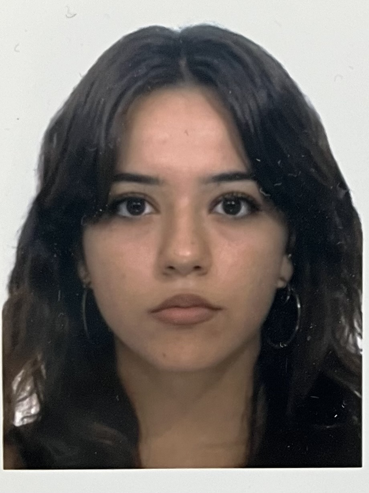

Mi chiamo Elena Salamini ho fatto tre anni di linguistico a codogno e tre di artistico indirizzo multimediale a piacenza, mi sono trasferita  a Napoli ad ottobre. Voglio sfruttare questi anni per acquisire ogni insegnamento che mi viene dato e acquisire più cultura e competenze pratiche possibili e crescere come persona, mi interessa la fotografia e il videomaking, ma sono aperta a scoprire ed esplorare qualsiasi campo. Vorrei in futuro viaggiare vivendo in camper dove mi porta il vento perchè odio l'idea di rimanere troppo in un unico luogo. 
